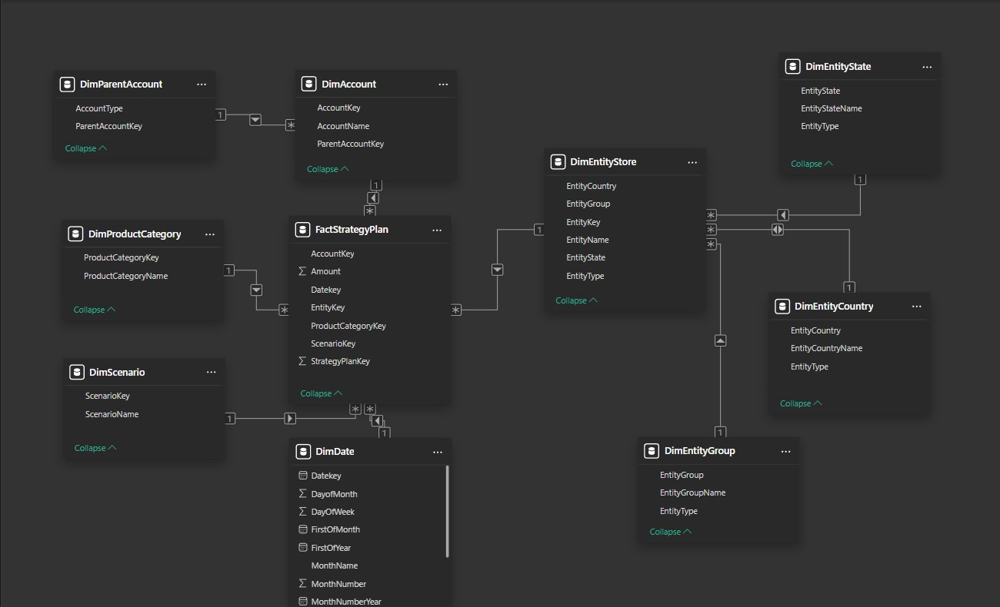
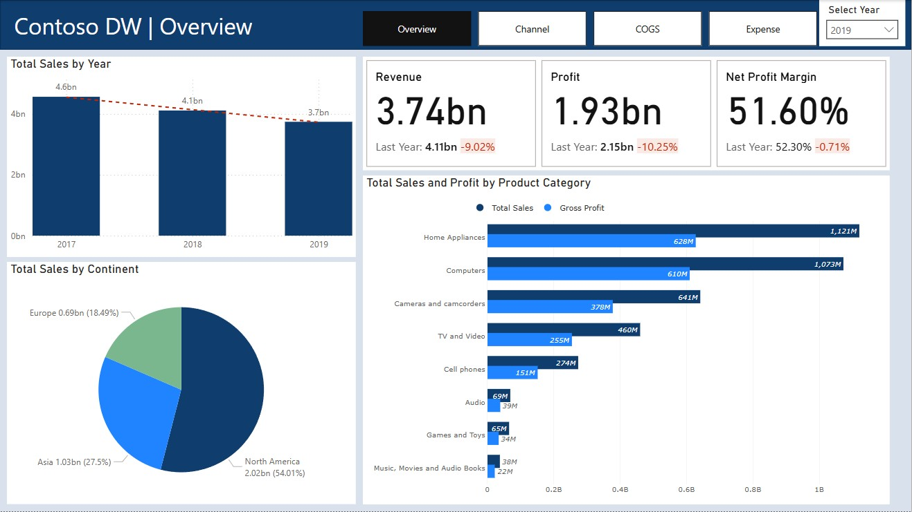
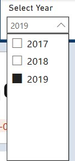
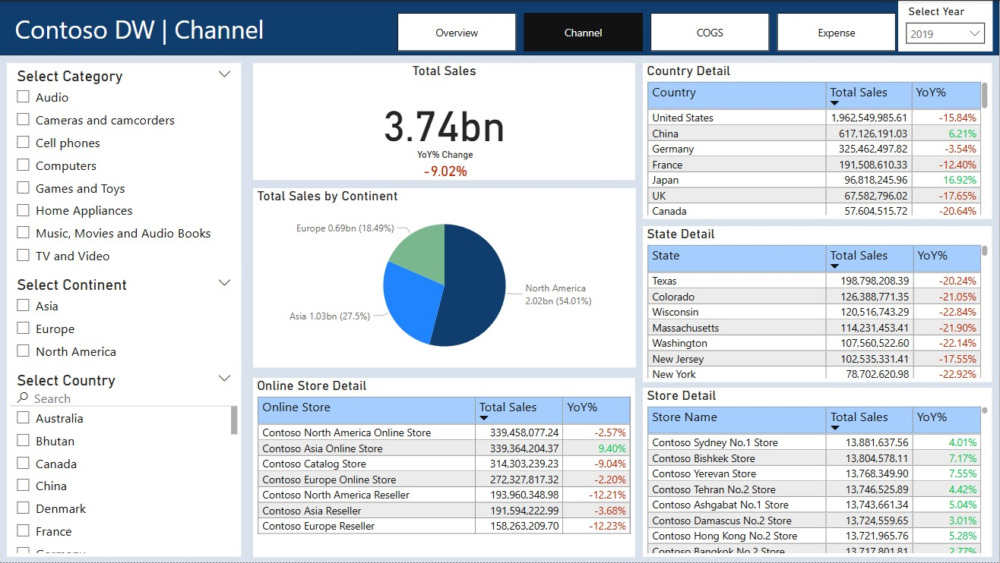
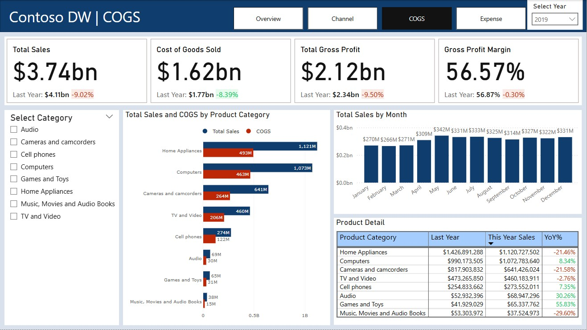
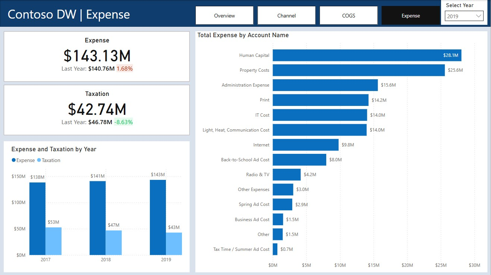

# Contoso DW - Marketing Analysis Report

This report provides a comprehensive analysis of the marketing performance for **Contoso DW**, a simulated online retail company. Leveraging data from the Contoso Data Warehouse and powered by **Power BI**, the report focuses on the **actual scenario** from the **DimScenario** table to evaluate sales performance, profitability, and expense trends across various channels. The insights generated are intended to inform strategic decision-making and optimize marketing initiatives.

---

## Table of Contents
1. [Introduction](#introduction)  
2. [Dataset Overview](#dataset-overview)  
3. [Data Preparation](#data-preparation)  
4. [Report and Visualization](#report-and-visualization)  
   - [Overview Page](#overview-page)  
   - [Channel Page](#channel-page)  
   - [Cost of Goods Sold (COGS) Page](#cost-of-goods-sold-cogs-page)  
   - [Expense Page](#expense-page)  
5. [Key Findings & Insights](#key-findings--insights)  
6. [Business Impact & Decision Support](#business-impact--decision-support)  
7. [How to Use This Project](#how-to-use-this-project)  
8. [Future Work & Improvements](#future-work--improvements)  
9. [References](#references)  

---

## Introduction
This report is designed to assess the overall marketing performance of **Contoso DW**. It examines sales performance across various channels, evaluates revenue and profit margins by product category, and analyzes expense trends over the years. Notably, the analysis focuses on the **actual scenario**—as defined in the **DimScenario** table—to provide an accurate reflection of current business conditions. The insights derived aim to support strategic decisions and optimize marketing efforts.

---

## Dataset Overview
The analysis is based on data sourced from the Contoso Data Warehouse. The key tables used in this report include:

- **FactStrategyPlan**: Contains sales transaction data.
- **DimAccount**: Provides detailed account information (Income, COGS, Expense, Taxation).
- **DimDate**: Contains date-related attributes (e.g., date key, month name, quarter, year).
- **DimEntity**: Includes information on the various sales channels.
- **DimProductCategory**: Provides details on the product categories.
- **DimScenario**: Contains scenario data (Actual, Budget, Forecast), with this report focusing on the **actual scenario**.

---

## Data Preparation

### Data Inspection and Cleaning
- Imported the dataset into **Power BI Desktop**.
- Conducted a thorough inspection to remove duplicates, outliers, and errors.
- Standardized data types and renamed tables for enhanced clarity.
- Addressed hierarchical issues in **DimAccount** and **DimEntity** by splitting and restructuring the tables using Excel.
  - **DimAccount** was split into **DimAccount** and **DimParentAccount** (comprising Income, COGS, Expense, and Taxation).
  - **DimEntity** was restructured into separate tables: **DimEntityGroup**, **DimEntityCountry**, **DimEntityState**, and **DimEntityStore**.
- Re-imported the cleaned data into Power BI.

### Data Model Relationships
- Established robust relationships among the tables to create a cohesive data model.
- Ensured that the **FactStrategyPlan** table aligns accurately with all dimensional tables.

> 

---

## Report and Visualization

### Overview Page
- **Key Metrics**: Displays total revenue, total profit, profit margin by year, and YoY % Change.
- **Visualizations**: Includes charts for annual revenue, revenue by continent, and sales & gross profit by product category.
- **Filter Options**: Users can filter annual sales data by year.

**Explanation**:  
The Overview Page provides a high-level summary of overall marketing performance. It allows stakeholders to quickly gauge the company’s financial health and understand macro-level trends, such as changes in revenue and profit margins over time. This page is essential for identifying broad trends and areas that warrant further investigation.

> 
> 

---

### Channel Page
- **Sales Breakdown**: Presents detailed sales data segmented by channel.
- **Hierarchical Details**: Includes a table displaying total sales and YoY % Change by continent, country, state, store, and online store.
- **Interactive Filters**: Enables filtering by category, continent, and country.

**Explanation**:  
The Channel Page facilitates a granular analysis of sales performance across various distribution channels. It helps determine which channels are most effective in driving sales and profitability. This information is crucial for optimizing channel strategies and ensuring resources are allocated effectively based on regional or channel-specific performance.

> 

---

### Cost of Goods Sold (COGS) Page
- **Financial Metrics**: Displays total sales, cost of goods sold (COGS), gross profit, gross profit margin, and YoY % Change.
- **Filter Options**: Users can filter data by product category.

**Explanation**:  
The COGS Page offers insights into product-level financial performance. It allows decision-makers to compare sales and associated costs, thereby identifying which product categories are the most profitable. This analysis is vital for cost control, pricing strategy, and assessing the impact of operational efficiencies on profitability.

> 

---

### Expense Page
- **Expense Analysis**: Presents detailed expense data, including revenue, total expense, total taxation, and YoY % Change.
- **Visual Support**: A bar chart provides a detailed breakdown of expense categories.

**Explanation**:  
The Expense Page helps identify major cost centers and assess overall expense trends. By understanding where the company’s funds are being allocated—particularly in areas such as taxation and operational expenses—stakeholders can develop strategies to optimize spending and improve profit margins.

> 

---

## Key Findings & Insights
- **Sales Trends**: Notable trends indicate a decline in sales since 2017, suggesting underlying market or operational challenges.
- **Channel Effectiveness**: Detailed analysis reveals which sales channels yield the highest returns, guiding resource allocation.
- **Product Profitability**: Certain product categories consistently outperform others, providing opportunities for targeted investments.
- **Expense Insights**: Significant expense categories and taxation trends have been identified, indicating areas for cost reduction.
- **Focus on Actual Scenario**: By concentrating on the **actual scenario** from the **DimScenario** table, the report provides a realistic view of current performance, ensuring decisions are based on real data rather than forecasts or budgets.

---

## Business Impact & Decision Support
This report helps executives, partners, and marketing managers make effective business decisions by:

- **Clear Business Overview**:  
  Displaying key metrics such as revenue, profit, and YoY changes allows decision-makers to quickly grasp overall performance.

- **Trend Identification and Timing**:  
  Analyzing annual and monthly sales trends helps identify periods of high or low performance, which is critical for strategic planning.

- **Evaluation of Sales Channel Effectiveness**:  
  Detailed insights on sales by channel enable targeted resource allocation and marketing strategy adjustments.

- **Product Performance Analysis**:  
  In-depth product-level insights allow for focused investments in high-performing product categories and improvements in underperforming areas.

- **Cost Management**:  
  Expense and taxation analysis provides a basis for cost reduction initiatives and better resource management.

- **Focus on Actual Business Conditions**:  
  Emphasizing the **actual scenario** ensures that decisions are based on real, up-to-date performance data.

- **Strategic Planning Support**:  
  The comprehensive insights support forecasting, budgeting, and long-term strategic planning efforts.

---

## How to Use This Project

### Power BI Report
1. Download the `contoso_dw_marketing_report.pbix` file.
2. Open it using **Power BI Desktop**.
3. Interact with the dashboards to explore detailed insights and trends.

### Using Cleaned Data
- The cleaned data files can be imported into **Python**, **R**, or **SQL** for further analysis.

---

## Future Work & Improvements
- **Dataset Expansion**: Incorporate additional datasets such as customer demographics and market trends for a more comprehensive analysis.
- **Advanced Analytics**: Develop predictive models to forecast future sales and inventory needs.
- **Cost Optimization**: Further analyze expense data to identify opportunities for cost reduction.
- **Dashboard Enhancements**: Refine visualizations for improved clarity and interactivity.

---

## References
- [DataCamp Dataset](https://www.datacamp.com)  
- Research papers on retail analytics, marketing strategies, and financial performance.

