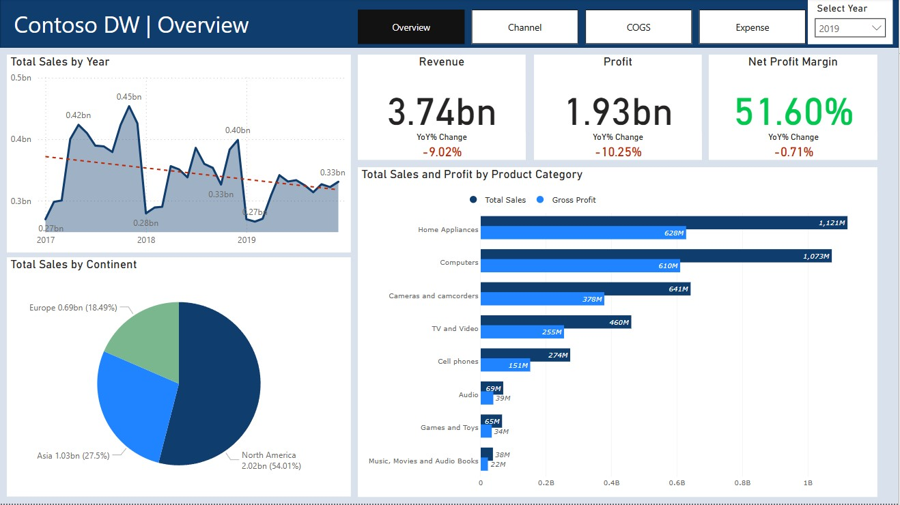
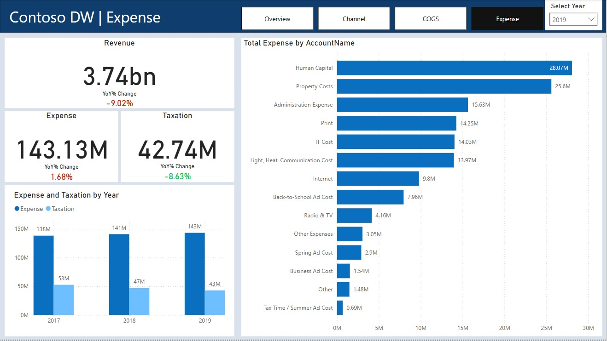

# Contoso DW - Marketing Analysis Report

📊 ข้อมูลในบทนี้มาจาก Contoso Data Warehouse
🏬 Contoso เป็นบริษัทค้าปลีกออนไลน์จำลองที่พยายามบรรลุเป้าหมายด้านยอดขาย

## Fact and Dimension Tables
- **Fact Table:** `FactStrategyPlan` - Stores sales transaction data.
- **Dimension Tables:** `Account`, `Date`, `Entity`, `Product Category`, `Scenario` - Provide detailed context about transactions.

## Data Preparation
### Loading and Cleaning Data
- Imported the dataset into Power BI Desktop.
- Inspected and cleaned each table to remove duplicates and errors, ensuring no outliers were present.
- Established relationships between tables within the data model.

## Report and Visualization
### Overview Page
   - Displays total revenue, total profit, profit margin by year, and Year-over-Year (YoY) % Change.
   - Includes Line charts for total revenue by Year, total revenue by Continent, and total sales and gross profit by category.
   - Annual sales can be filtered by year.

### Channel Page
   - Displays sales details by Channel.
   - Includes a table showing total sales and YoY% change by Continent, Country, State, Store, and Online Store.
   - Filters available for country, channel, and category.

### Cost of Goods Sold (COGS) Page
   - Provides details about the products sold by Contoso DW.
   - Shows total sales, cost of goods sold, gross profit, gross profit margin, and YoY % Change.
   - Allows filtering by product category.

### Expense Page
   - Displays Expense details by Contoso DW company.
   - Shows Revenue, total expense, total taxation, and YoY % Change.
   - Can see detail of expense on right bar chart.

## Conclusion
For more detailed insights, you can download the Power BI report (`.pbix` file). Thank you for reviewing this report.
