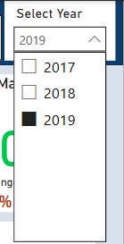

# Contoso DW - Marketing Analysis Report

 📊 This report is based on data from the Contoso Data Warehouse.
 🏬 Contoso is a simulated online retail company aiming to achieve its sales targets.

## Fact and Dimension Tables
### Fact Table
- **FactStrategyPlan:** Stores sales transaction data.

### Dimension Tables
- **Account:** Provides detailed context about accounts.
- **Date:** Provides detailed context about dates.
- **Entity:** Provides detailed context about entities.
- **Product Category:** Provides detailed context about product categories.
- **Scenario:** Provides detailed context about scenarios.

## Data Preparation
### Loading and Cleaning Data
- Imported the dataset into Power BI Desktop.
- Inspected and cleaned each table to remove duplicates and errors, ensuring no outliers were present.
- Established relationships between tables within the data model.

## Report and Visualization
### Overview Page
- Displays total revenue, total profit, profit margin by year, and Year-over-Year (YoY) % Change.
- Includes line charts for total revenue by year, total revenue by continent, and total sales and gross profit by category.
- Annual sales can be filtered by year.

### Channel Page
- Displays sales details by channel.
- Includes a table showing total sales and YoY% change by continent, country, state, store, and online store.
- Filters available for country, channel, and category.

### Cost of Goods Sold (COGS) Page
- Provides details about the products sold by Contoso DW.
- Shows total sales, cost of goods sold, gross profit, gross profit margin, and YoY % Change.
- Allows filtering by product category.

### Expense Page
- Displays expense details by Contoso DW company.
- Shows revenue, total expense, total taxation, and YoY % Change.
- Detailed expense information is available on the right bar chart.

## Conclusion
For more detailed insights, you can download the Power BI report (`.pbix` file). Thank you for reviewing this report.
