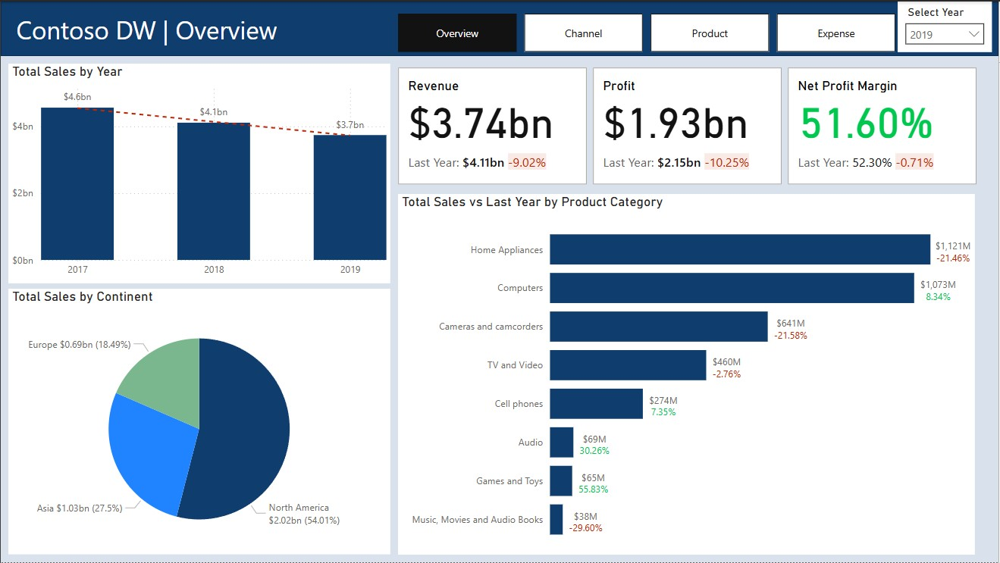
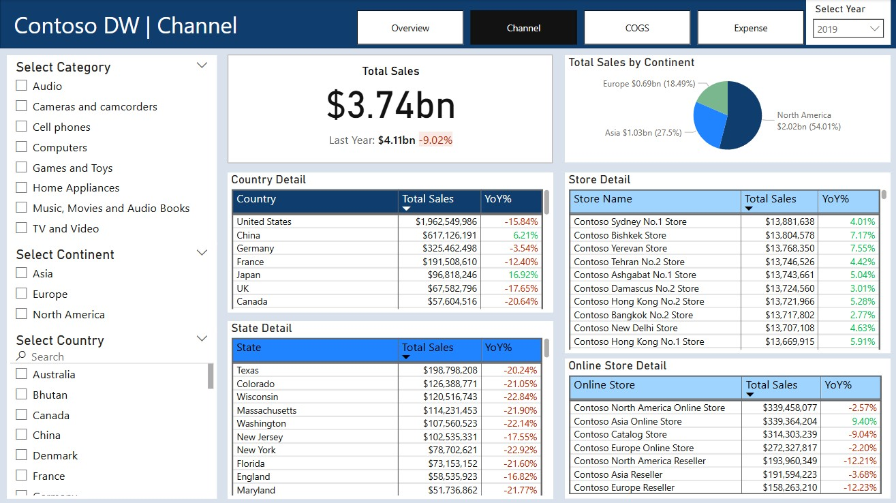

# 📊 Contoso DW - Marketing Analysis Report

**Contoso DW** is a simulated online retail company. This Power BI report focuses on the **Actual** scenario from the **DimScenario** table to deliver actionable insights into sales performance, profitability, and expense trends across multiple channels. By translating raw data into clear visualizations, this dashboard empowers strategic decision-making and optimizes marketing investments.

---

## 📌 Table of Contents
1. [Introduction](#introduction)  
2. [Dataset Overview](#dataset-overview)  
3. [Data Preparation](#data-preparation)  
4. [Report & Visualization](#report--visualization)  
   - [Overview Page](#overview-page)  
   - [Channel Page](#channel-page)  
   - [Product Page](#product-page)  
   - [Expense Page](#expense-page)  
5. [Key Findings & Insights](#key-findings--insights)  
6. [Business Impact & Decision Support](#business-impact--decision-support)  
7. [How to Use This Report](#how-to-use-this-report)  
8. [Future Enhancements](#future-enhancements)  
9. [References](#references)

---

## Introduction
This report evaluates **Contoso DW’s** marketing performance by analyzing real transaction data (Actual scenario) from the Data Warehouse. It examines revenue, costs, and expenses to identify trends, benchmark performance, and highlight areas for improvement.

---

## Dataset Overview
The analysis leverages the following tables:

- **FactStrategyPlan**: Sales transactions (Actual scenario)  
- **DimAccount**: Account hierarchies (Income, COGS, Expense, Taxation)  
- **DimDate**: Date attributes (day, month, quarter, year)  
- **DimEntity**: Sales channels (Group, Country, State, Store)  
- **DimProductCategory**: Product categories  
- **DimScenario**: Scenario types (Actual, Budget, Forecast)  

All visuals and metrics are filtered to show **Actual** data.

---

## Data Preparation

### 1. Data Inspection & Cleaning
- Imported all tables into Power BI Desktop.  
- Removed duplicates, corrected data types, and standardized naming conventions.  
- Resolved hierarchies in `DimAccount` and `DimEntity` by splitting into parent/child tables.  

### 2. Data Modeling
- Created a **Date** dimension for time intelligence.  
- Defined relationships between fact and dimension tables for accurate filtering and aggregation.

> 

---

## Report & Visualization

### Overview Page
- **KPIs**: Total Sales, Total Profit, Profit Margin, YoY % Change  
- **Charts**: Annual revenue trends, sales by continent, product category comparisons  
- **Filters**: Year selector for temporal analysis  

**Purpose**: Offers an executive summary of financial performance and high-level trends.

> 
> 

---

### Channel Page
- **Total Sales**: Highlighted with YoY comparison  
- **Sales by Continent**: Pie chart breakdown  
- **Country, State & Store Details**: Tables showing top performers and growth rates  

**Purpose**: Enables deep-dive into channel performance and geographic market analysis.

> 

---

### Product Page
- **Metrics**: Total Sales, Cost of Goods Sold, Gross Profit, Gross Profit Margin  
- **Visuals**: Sales vs. COGS by category, monthly revenue bar chart, product-level table  

**Purpose**: Evaluates product-level profitability and cost efficiency.

> 

---

### Expense Page
- **Key Figures**: Total Expense, Taxation, YoY % Change  
- **Visuals**: Expense & taxation trends by year, expense breakdown by account name  

**Purpose**: Identifies major cost drivers and taxation impacts to guide cost management.

> 

---

## Key Findings & Insights
- **Sales Decline Since 2017**: Indicates market or operational challenges.  
- **Channel Leaders**: North America drives 54% of sales; Asia growth at +16.9% YoY.  
- **Product Profitability**: Home Appliances have the highest revenue, and Cameras and camcorders have the highest margins.  
- **Expense Trends**: Human Capital and Property Costs dominate expenditures.  

---

## Business Impact & Decision Support
This dashboard equips stakeholders to:
- **Quickly Assess** overall financial health with executive KPIs.  
- **Optimize Channel Strategy** by reallocating resources to high-growth markets.  
- **Improve Profitability** through targeted cost controls and product focus.  
- **Plan Strategically** with data-driven forecasts and scenario analysis.

---

## How to Use This Report
1. Download the Power BI file: `marketing_report.pbix`  
2. Open in **Power BI Desktop**  
3. Navigate between Overview, Channel, Product, and Expense pages  
4. Use slicers (Year, Category, Continent) to filter data

---

## Future Enhancements
- Integrate real-time data feeds for live monitoring  
- Add forecasting models for sales and expense projections  
- Enhance visual interactivity with drill-through and bookmarks  

---

## References
- [DataCamp Dataset](https://www.datacamp.com)
- Power BI documentation and best practices  
- Industry research on retail analytics and cost management
